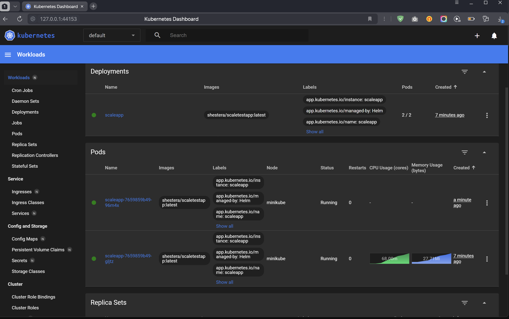

# Спринт 6

## Задание 1

[Схема](Exc1/InsureTech_технологическая_архитектура_to-be.drawio)

## Задание 2

Без дополнительного задания.

#### Старт сервиса 

#### При потреблении памяти больше 80% автоматически создается второй pod.

## Задание 3

[Список проблем и рисков с ростом нагрузки](Exc3/README.md)

[Диаграмма с предложением решения проблем](Exc3/InsureTech_C4_сontainer-diagram.drawio)

## Задание 5

[Схема GraphQL](Exc5/schema.graphql)

## Задание 6

[Конфигурационный файл Nginx](Exc6/nginx.conf)